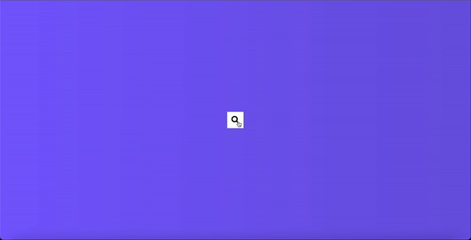

# Hidden_Search
A simple hidden search bar implementation using HTML, CSS, and JavaScript.

## Preview

## Technologies Used

- HTML
- CSS
- JavaScript

## Features

- Hidden search bar that slides in when activated
- Smooth animation effects
- Customizable styles

## Usage

1. Clone the repository.
2. Open the `index.html` file in your web browser.

## Acknowledgement

The project is part of the "50 projects in 50 days - HTML, CSS & Javascript" course on Udemy by Brad Traversy.
